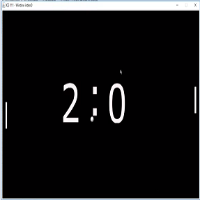

This ping pong game was created as a final project of ICS 111. Two people were involved in the making of this program. I was in charge of programming the interactions between the computer and the players. Although the class provided EZ.java file was used to implement action listeners, it was necessary for students to correctly implement them to ensure that the controls did the right things. In addition, I was also responsible for making images suitable for the game. My partner was mainly involved in generating the loops required for the win condition of each player (which in this case happened to be the same). Both of us actively worked together to revise each other's code to ensure that the program ran smoothly.

From this experience, I learned that game development was a lot more difficult than I originally envisioned. Despite being such a simple game, it took a lot of time for my partner and I to code and debug any errors that were found. I believe that it was a great first step towards programming something that actually interacts with the user, compared to the typical printing to console programs that we usually make in class. It was overall an enjoyable and a learning experience.

A link to a demo of our program on Youtube: https://www.youtube.com/watch?v=jDPdvUH2fbI

Source Code: Not available. Was not intended for public use.

