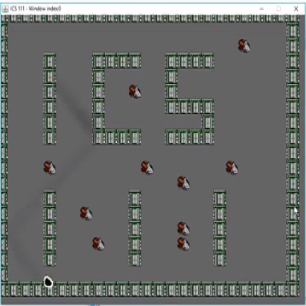

This project demonstrated the fundamental mechanics of a Roomba: when it collides with an another object, it changes direction. In this program, I had to utilize the random number generator to decide which direction the Roomba was going to move after collision, how fast the Roomba was going to move, and where the dirt is gonna spawn on each instance of the program running. This project was also the first time I had to utilize an array in coding. The dirt blocks and wall blocks were all stored individually in their respective arrays. Image files with the assistance of EZ were generated using the index of the different arrays. 

This project made me learn that coding takes a lot of thinking, and problem solving skills. During the time this program was made, I had great difficulty with the random number generator. In order to fix the problem that I encountered, I had to use my problem solving skills to figure out how I can make it work the way I want it to. It was the stereotypical programmer situation of taking hours to think about how to solve the problem, and only using 20 seconds to solve it. Upon current reflection, the problem seems way too easy to solve now, but at the time, it gave me a feel for how difficult computer science really was.

A link to a Youtube video demonstrating my program: https://www.youtube.com/watch?v=cQNAsy1K0Nw

Source Code: Not available. Originally not intended for public use.
